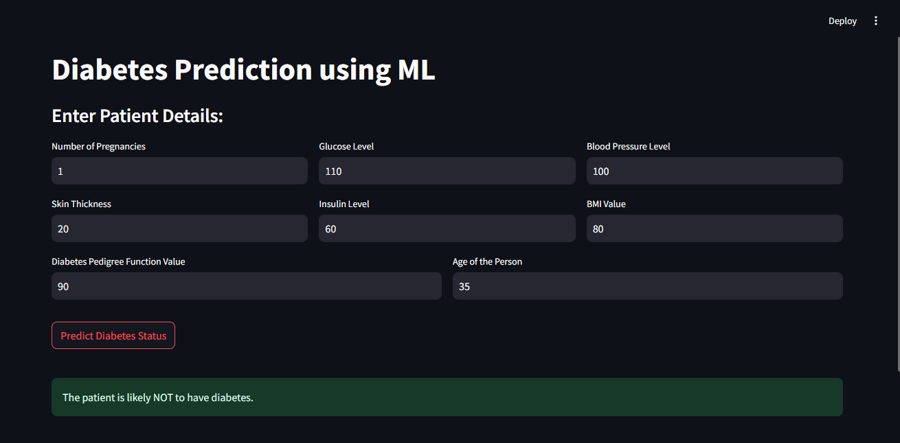

# Diabetes Prediction System

A machine learning-based web application for predicting diabetes using patient data. This project is built with Streamlit and utilizes machine learning models to provide accurate predictions.

## Features
- User-friendly web interface with Streamlit
- Predicts diabetes based on input parameters
- Utilizes machine learning for accurate results
- Easy to deploy and use

## Technologies Used
- Python
- Streamlit
- Scikit-learn
- Pandas
- NumPy

## Installation

1. Clone the repository:
   ```bash
   git clone https://github.com/Ganesh0935/DiabetesPrediction.git
   cd DiabetesPrediction
   ```

2. Install dependencies:
   ```bash
   pip install -r requirements.txt
   ```

3. Run the Streamlit app:
   ```bash
   streamlit run app.py
   ```
## Output




## Usage
1. Open the application in your browser.
2. Enter the required patient details.
3. Click the **Predict** button to get the diabetes prediction result.

## Contributing
Contributions are welcome! Feel free to submit a pull request or open an issue for suggestions.

## Contact
For any queries, feel free to reach out to dganesh0935@gmail.com
